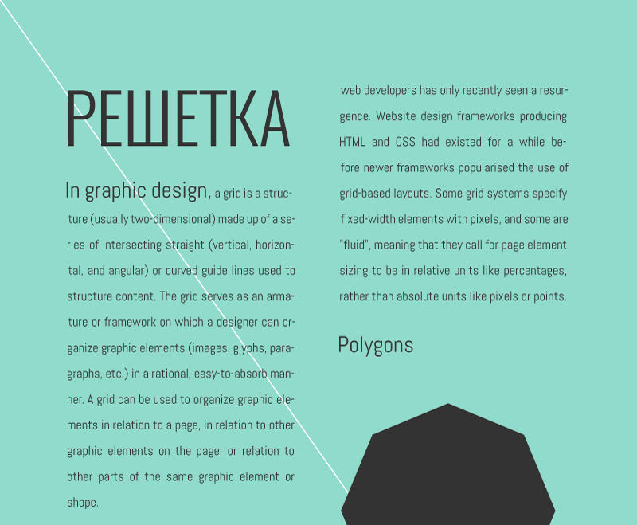
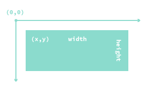
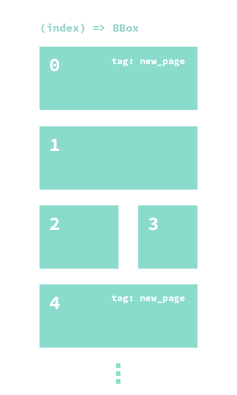
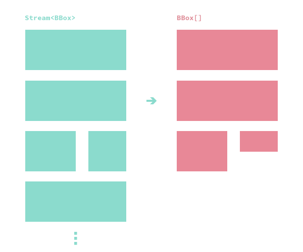
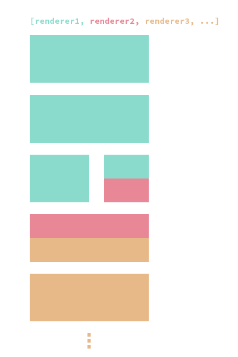
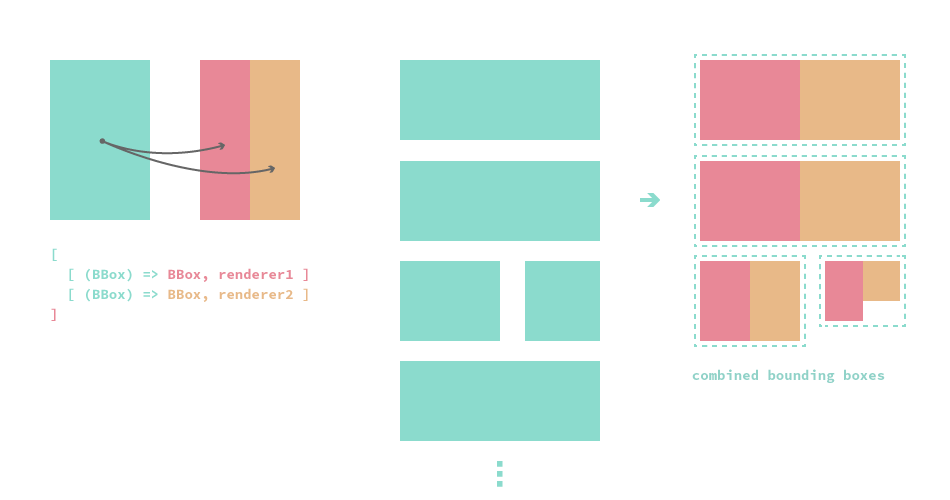

# leerraum.js

leerraum.js is a PDF typesetting / layouting library based on [typeset](https://github.com/bramstein/typeset) (which provides an implementation of the [Knuth and Plass line breaking algorithm](http://onlinelibrary.wiley.com/doi/10.1002/spe.4380111102/abstract)) and [pdfkit](http://pdfkit.org). Its goals are simplicity and perfect control over the positioning of graphic elements.



[Demo PDF](docs/example.pdf) - [source](examples/Example.ts)

## Table of contents

* [Motivation](#motivation)
* [Installation](#installation)
* [Generating the example PDF](#generating-the-example-pdf)
* [Basic usage](#basic-usage)
* [Documentation](#documentation)
  * [Bounding boxes](#bounding-boxes)
  * [Streams](#streams)
    * [Basic streams](#basic-streams)
  * [Styles](#styles)
  * [Renderers](#renderers)
    * [Text](#text)
    * [Polygons](#polygons)
    * [Tables](#tables)
    * [Page breaks](#page-breaks)
  * [Combinators](#combinators)
  * [Formats](#formats)
  * [PDF output](#pdf-output)
  * [Miscellaneous](#miscellaneous)

## Motivation

leerraum.js *does not* aim to be a replacement for LaTeX. Its main difference to other typesetting systems like [Patoline](https://www.patoline.org) or [SILE](http://sile-typesetter.org/) is that it is just a Javascript library rather than being a full blown document processing system with a domain specific language. The motivation behind that decision is that while initial setup cost may be a bit higher, in many circumstances the convenience of a general purpose language is just a bit too hard to give up (i.e. extensibility, generative design, templating, pulling records from a database, etc.)

leerraum.js is especially well suited for situations in which perfect control over positioning, layout and high quality hyphenated line breaking is essential.

leerraum.js is *not* well suited for math typesetting, books or when features from LaTeX or other typesetting systems are required.

## Installation

    npm install leerraum

## Basic usage

```typescript
const leer = require('leerraum');

const text =
  [
    {
      leading: 60,
      spans:
      [
        {
          fontFamily: 'fonts/Roboto-Regular.ttf',
          fontSize: 60,
          text: 'leerraum.js',
        },
      ]
    }
  ];

leer.renderToPDF('test.pdf', leer.formats.A4,
  [
    {
      bboxes: leer.withMargins(leer.formats.A4, 72, 72, 72, 72),
      renderer: leer.renderText(text)
    }
  ]);
```
## Generating the example PDF

Install [Typescript](https://www.typescriptlang.org). Then:

```bash
git clone https://github.com/pkamenarsky/leerraum.js.git
cd leerraum.js
npm install
tsc -p .
node node js/examples/Example.js
```

`example.pdf` should be generated in the current directory.

## Documentation

Everything in leerraum.js is measured in points.

### Bounding boxes

A bounding box is a rectangle, along with an optional `tag`:

```typescript
type BBox = {
    tag?: string,
    x: number,
    y: number,
    width: number,
    height: number
}
```



### Streams

A stream is a pure function from an index to a `BBox`:

```typescript
type Stream<BBox> = (index: number) => BBox
```



Tags may be used to mark specific bounding boxes - i.e. the first bounding box on every page can be marked with a `'new_page'` tag, allowing for a renderer to skip ahead to the next page break.

#### Basic streams

```typescript
function withMargins(
  format: Format,
  marginTop: number,
  marginRight: number,
  marginBottom: number,
  marginLeft: number
): Stream<BBox>
```

`withMargins` generates an infinite stream of bounding boxes of the provided format with the specified margins in points. Each bounding box is tagged with a `new_page` tag.

```typescript
function columnsWithMargins(
  format: Format,
  gap: number,
  marginTop: number,
  marginRight: number,
  marginBottom: number,
  marginLeft: number
): Stream<BBox>
```

`columnsWithMargins` generates an infinite stream of bounding boxes of the provided format with the specified margins in points, laid out in two columns. Every bounding box with an even index is tagged with a `new_page` tag.

### Styles

Styles combine some basic drawing parameters:

```typescript
type Style = {
    lineWidth?: number,
    strokeColor?: string,
    fillColor?: string,
    strokeOpacity?: number,
    fillOpacity?: number,
    lineJoin?: 'miter' | 'round' | 'bevel',
    lineCap?: 'butt' | 'round' | 'square',
}
```

Colors are in '#' + hexadecimal, opacities are in the 0 - 1 range.

### Renderers

The basic building block of leerraum.js is a `Renderer`:

```typescript
type Renderer = (measures: Measures, bboxes: Stream<BBox>) => [BBox[], RenderNode[]]
```

Simply said, a renderer is a pure function from a stream of bounding boxes (describing the geometry in which the to-be-rendered graphic element will be laid out) to an array of actually occupied bounding boxes and an array of abstract `RenderNode`s.



Why are renderers operating on streams instead of simple arrays? Because oftentimes it is not possible to estimate the area (and thus the size or number of bounding boxes) that certain graphic elements, like text, are going to occupy before actually laying them out. A lazy, infinite stream of bounding boxes solves that problem.

#### Text

```typescript
function renderParagraph(paragraph: Paragraph): Renderer
```

`renderParagraph` renders a paragraph of text:

```typescript
type Paragraph = {
    align?: 'left' | 'center' | 'justify',
    leftIndentation?: (line: number) => number,
    rightIndentation?: (line: number) => number,
    leading: number,
    paragraphLeading?: number,
    tolerance: number,
    spans: Span[],
    hypher?: any
}
```

`leftIndentation` and `rightIndentation` control the left and right indentation (in points) per line, respectively. `leading` (in points) indicates the distance between successive lines of text, while `paragraphLeading` specifies the distance between the current and next paragraphs.

`hypher` is an optional [Hypher](https://github.com/bramstein/hypher) instance used for hyphenation. If none is provided, `hyphenation.en-us` is used.

`tolerance` specifies the maximum amount of allowed space stretching / shrinking (if none is provided, a default value of 10 is used). Note that if the paragraph can not be laid out according to the provided tolerance, no text will be rendered.

`Paragraph` also contains an array of `Span`s:

```typescript
type Span = {
    fontFamily: string,
    fontSize: number,
    text: string,

    hyphenate?: boolean,
    style?: Style,

    options?: any
}
```

`fontFamily` must contain *the full path of a `pdfkit`-compatible font file*. `fontSize` is the font size in points, `hyphenate` is a flag indicating whether the span should be hyphenated. `text` contains the span text to be rendered with an optional drawing style provided by `style`. The `options` field is passed to `pdfkit` directly.

`renderText` is just a convenience function for rendering an array of paragraphs:

```typescript
type Text = Paragraph[]

function renderText(text: Text): Renderer
```

#### Polygons

`renderPolygon` renders a polygon with the provided style specified by an array of points:

```typescript
type Point = { x: number, y: number }

function renderPolygon(points: Point[], style: Style): Renderer
```

#### Tables

```typescript
function renderTable(gap: number, cols: [number], cells: Renderer[][]): Renderer
```

`renderTable` renders a table with the provided column widths, in points, and the cell renderers specified by `cells` (which may be anything - text, polygons, even tables).

For now, only absolute column widths are supported (due to laziness, PRs welcome.)

#### Page breaks

```typescript
const pageBreak: Renderer
```

`pageBreak` introduces a page break (by skipping ahead to the next bounding box with a `new_page` tag.)

### Combinators

The power of leerraum.js stems from the fact that renderers are pure functions and thus can easily be combined to create new renderers.

Two combinators are provided out of the box:

```typescript
vertically(renderers: Renderer[]): Renderer
```

`vertically` produces a new renderer by laying out the provided array of renderers vertically:



```typescript
combine(renderers: [(bbox: BBox) => BBox, Renderer][]): Renderer
```

`combine` takes an array of tuples of bounding box-mapping functions (i.e. `(BBox) => BBox`) and renderers. In essence, `combine` produces a new renderer by transforming its original stream of bounding boxes according to the mapping functions, feeding each transformed stream into its corresponding renderer and finally returning the union of occupied bounding boxes originating from each streamed bounding box:



### Formats

```typescript
type Format = {
    width: number,
    height: number
}
```

A `Format` specifies page dimensions. The map `leerraum.formats` contains a number of useful formats (`A4`, `LETTER`, etc).

```typescript
function landscape(f: Format): Format
```

`landscape` turns a portrait format into landscape.

### PDF output

```typescript
function renderToPages(
  doc,
  format: Format,
  layers: RenderNode[][],
  background?: (page: number) => RenderNode[][])
```

`renderToPages` is a lower-level function for outputting `RenderNode`s obtained by a renderer. In the most trivial case, one might do the following:

```typescript
const leer = require('leerraum');
const PDFDocument = require('pdfkit');
const fs = require('fs');

const doc =
  new PDFDocument({layout: 'portrait', size: [leer.formats.A4.width, leer.formats.A4.height]});
const measures = leer.pdfMeasures(doc);

doc.pipe(fs.createWriteStream('test.pdf'));

const [_, render_nodes] =
  leer.renderText(...)(measures, leer.withMargins(leer.formats.A4, 72, 72, 72, 72));

leer.renderToPages(doc, leer.formats.A4, [render_nodes]);

doc.end();
```

Note that `renderToPages` takes *an array* of `RenderNode` arrays, which allows for rendering multi-layered documents. Each layer may be obtained by different combinations of bounding box streams and renderers.

There's also an optional `background` parameter, which is a function from a page index to a number of `RenderNode` layers (like above). The background layers, if specified, are rendered first, on every page.

Why two set of layers? In principle, one might just provide the background layers for every page in `layers`. The problem however, is that different layers can't share information with each other, which makes it impossible to e.g. render a blue background on every page but *stop* when there's no more text to be rendered in another layer.

A more convenient function to use is `renderToPDF`:

```typescript
function renderToPDF(
  filename: string,
  format: Format,
  renderers: { bboxes: Stream<BBox>, renderer: Renderer}[],
  background?: (page: number) => { bboxes: Stream<BBox>, renderer: Renderer}[]): void
```

The above example could be expressed much simpler in the following way:

```typescript
const leer = require('leerraum');

leer.renderToPDF('test.pdf', leer.formats.A4,
  [
    {
       bboxes: leer.withMargins(leer.formats.A4, 72, 72, 72, 72),
       renderer: leer.renderText(...)
    }
  ]);
```

### Miscellaneous

`Measures` is a collection of functions for measuring font metrics.

`RenderNode`s are abstract descriptions of laid out, ready-to-be-rendered elements (text fragments, polygons, etc).

## Contributions

Bug reports, bug fixes, ideas, PRs welcome!
